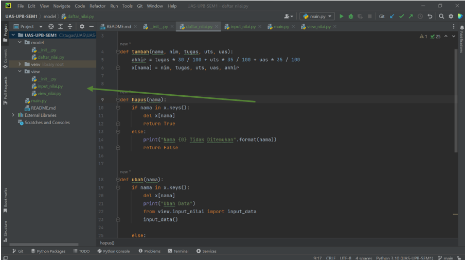

# NAMA          = M. IQBAL FADILLAH
# NIM           = 312210586
# KELAS         = TI.22 B.2
# MATA KULIAH   = BAHASA PEMROGRAMAN

# SOAL

# CODE
1. Pertama - tama buat packaging dan modul seperti gambar berikut :

2. Lanjut isi modul daftar_nilai.py dengan sytax berikut :

3.	Lanjut isi modul input_nilai.py dengan sytax berikut :

4.	Lanjut isi modul view_nilai.py dengan sytax berikut :

5.	Lanjut isi modul main.py dengan sytax berikut :

6.	Saatnya kita running. Running dengan main.py

# OUTPUT

1. INPUT

2. TAMBAH

3. LIHAT

4. UBAH

5. KELUAR

# TERIMAKASIH

